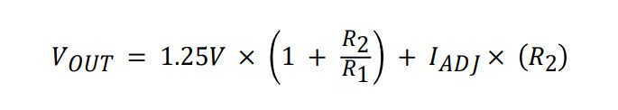

# AC-DC Converter with LM317

This is a AC-DC Converter with LM317 voltage regulator IC.  
It converts an AC input into a stable adjustable or fixed 5V DC output using a full-wave bridge rectifier, filter capacitors, and LM317 regulator.

---

## Features

- Input: AC 12–15V (via transformer secondary)
- Output: 1.25V – 12V DC (adjustable) or 5V Fixed 
  *(depends on input voltage and load conditions)*
- Maximum Output Current: 1A (need to add heatsink)
- Built-in fuse protection on AC input

---

## How It Works

1. AC to DC Conversion
   The input AC voltage passes through a **fuse (F1)** for protection.  
   The **bridge rectifier (D1–D4)** converts AC to DC signal.

2. Input Filter 
   Two decoupling capacitors:
   - Polarized Capacitor 1000µF smooths the rectified DC.  
   - Non Polarized 100nF filter high-frequency noise input.

4. Voltage Regulation (LM317)  
   The LM317 regulates the voltage according to the equation:  
   
  
5. Output Filter
   Two decoupling capacitors:
   - Polarized Capacitor 1000µF smooths the regulator output.  
   - Non Polarized 100nF filter high-frequency noise.
    
7. Load Output 
   The regulated DC voltage is available at J2 connector pins.

---

## Design Notes

- Use a **12–18V AC transformer** capable of at least **1A output current**.  
- The LM317 requires a **heatsink** for continuous load operation.  
- Output voltage ripple depends on **C1** and load current — for lower ripple, increase C1.  
- Always ensure correct **polarity** before connecting your load.

---

## Applications

- Bench/lab adjustable DC power source  
- Battery charging experiments  
- Testing and calibration of small circuits  
- Educational demonstration of linear voltage regulation
